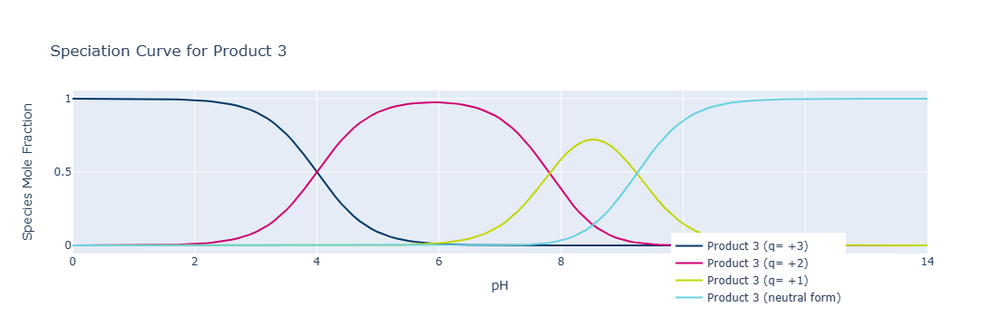
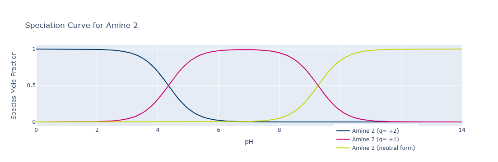
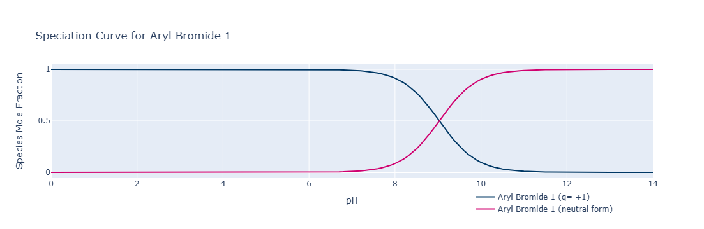
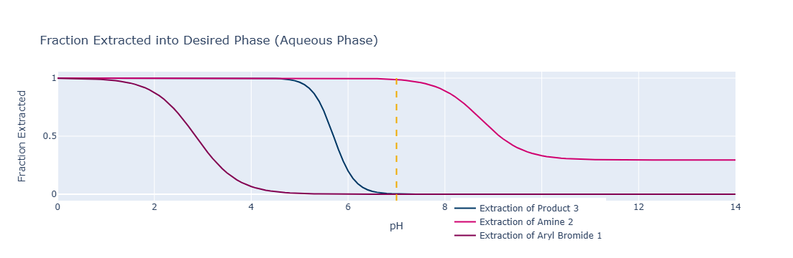
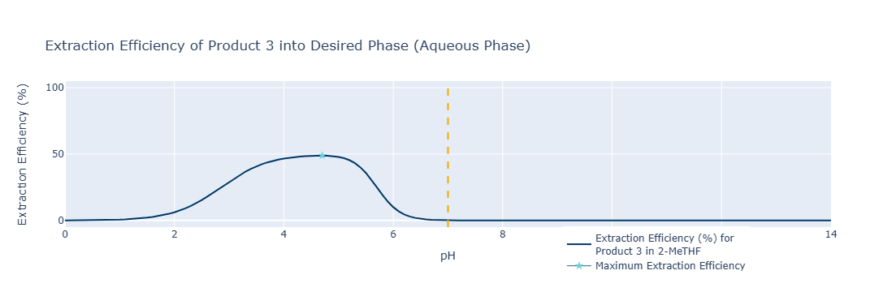
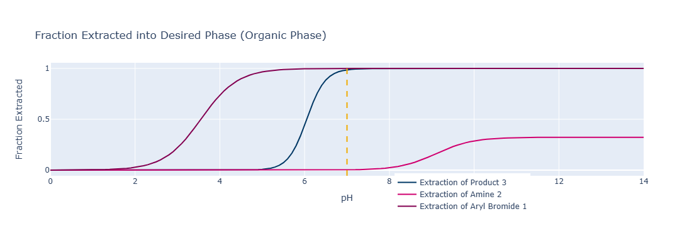
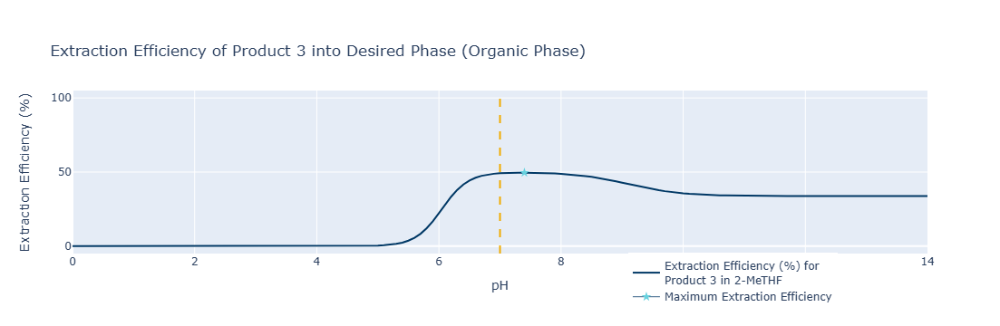

## A Digital Tool for Liquid-Liquid Extraction Process Design

This is a repository to support the publication "A Digital Tool for Liquid-Liquid Extraction Process Design"

Below is a worked example for the code shared in this repository.

Use the "LLE_Digital_Tool_requirements.txt" file to create your virtual environment using pip and Python 3.10 or above.

For example:

```console
pip install -r LLE_Digital_Tool_requirements.txt
```

Please feel free to amend the code to serve your respective data structures and objects.

Sections:

1. [Procedural Processing](#Processing)

Setting system and compounds dictionary objects. Loading solvents and compounds' physical properties data. Use of functions to get the data for each compound.

2. [Visualisations](#Visualisations)

Visualising speciation curves, fraction extracted, and extraction efficiency in each phase (aqueous or organic).

3. [Results](#Results)

Generate results in tabulated form using defined functions.

4. [Contact](#Contact)

Contact Details for questions, comments, and suggestions.

### Processing

The functions definitions can be found in the LLEFunctions.py file. Here is an example of their use.

First, let's load the data required:


```python
# Define data objects using helper function
solvents, functional_groups, pred_pka, pivoted_solvents, structures = load_local_data()
```

Then, we need to define the system and compound dictionary objects:


```python
system_panel_values = {
  "Aqueous Phase": 25,
  "Organic Phase": 25,
  "Total Volume": 50,
  "Aqueous Phase Proportion": 50,
  "Organic Phase Proportion": 50,
  "Relative Phase Volume": 1,
  "Extraction (Aqueous Phase) pH": 7,
  "Extraction Phase": "Aqueous",
  "Current Solvent": "2-MeTHF",
  "Number of compounds to separate": 2
}

compounds_panel_values = {
  "c0": {
    "Name": "PRODUCT 3",
    "Isolate": True,
    "Impurity": False,
    },
  "c1": {
    "Name": "AMINE 2",
    "Isolate": False,
    "Impurity": True,
    },
  "c2": {
    "Name": "ARYL BROMIDE 1",
    "Isolate": False,
    "Impurity": True,
    }
}
```

Now let's use the appropriate functions to get the data into the compounds dictionary object


```python
for compound in compounds_panel_values.values():
    try:
        name = compound.get('Name').lower().title()  # get name to search for PPP data
        compound = RetrieveCompoundPhysChem(compound, pred_pka)  # add physchem data for compound to dictionary
        compound = RetrieveSmilesToMol(compound, structures)  # add mol data to dictionary
        compound['Vr'] = system_panel_values['Relative Phase Volume']
        logp_value = pivoted_solvents.loc[system_panel_values['Current Solvent'], name]
        compound['Kp'] = 10 ** logp_value
        compound['validity'] = True
    except:  # if any of the above fails, compound and system will not be valid
        compound['validity'] = False
        system_panel_values['Check'] = False
```

Let's call the object to make sure the necessary data have been added to each compound:


```python
# check that it worked
compounds_panel_values
```


    {'c0': {'Name': 'PRODUCT 3',
      'Isolate': True,
      'Impurity': False,
      'pka_data': True,
      'Forms': ['Product 3 (q= +3)',
       'Product 3 (q= +2)',
       'Product 3 (q= +1)',
       'Product 3 (neutral form)'],
      'pka_values': [4.0, 7.81, 9.24],
      'Kas': [0.0001, 1.5488166189124828e-08, 5.754399373371567e-10],
      'Neutral Form': 4,
      'Extraction': 'Extraction of Product 3 [Form 4]',
      'Structure': <rdkit.Chem.rdchem.Mol at 0x1ddde8cdbe0>,
      'Vr': 5.0,
      'Kp': 91754.88389387833,
      'validity': True},
     'c1': {'Name': 'AMINE 2',
      'Isolate': False,
      'Impurity': True,
      'pka_data': True,
      'Forms': ['Amine 2 (q= +2)', 'Amine 2 (q= +1)', 'Amine 2 (neutral form)'],
      'pka_values': [4.35, 9.27],
      'Kas': [4.466835921509635e-05, 5.370317963702532e-10],
      'Neutral Form': 3,
      'Extraction': 'Extraction of Amine 2 [Form 3]',
      'Structure': <rdkit.Chem.rdchem.Mol at 0x1ddde8cdee0>,
      'Vr': 5.0,
      'Kp': 0.4776670563746566,
      'validity': True},
     'c2': {'Name': 'ARYL BROMIDE 1',
      'Isolate': False,
      'Impurity': True,
      'pka_data': True,
      'Forms': ['Aryl Bromide 1 (q= +1)', 'Aryl Bromide 1 (neutral form)'],
      'pka_values': [9.03],
      'Kas': [9.332543007969924e-10],
      'Neutral Form': 2,
      'Extraction': 'Extraction of Aryl Bromide 1 [Form 2]',
      'Structure': <rdkit.Chem.rdchem.Mol at 0x1ddde8cd9a0>,
      'Vr': 5.0,
      'Kp': 301304.237796788,
      'validity': True}}


### Visualisations

We can loop over the compounds dictionary object to visualise Ionic form fractions (speciation) and fraction extracted for each compound, as well as the extraction efficiency in the defined phase (currently set to "Aqueous").


```python
# generate speciation curves
for compound in compounds_panel_values.values():
    if compound.get('Isolate'):
        fig_1 = PlotSpecies(compound)
        display(fig_1)

    elif compound.get('Impurity'):
        fig_1 = PlotSpecies(compound)
        display(fig_1)
```








```python
# generate and plot fraction extracted curves
fig2 = PlotFractionExtracted(compounds_panel_values, system_panel_values)
display(fig2)
```




```python
# generate and plot extraction efficiency
fig3 = PlotExtractionEfficiency(compounds_panel_values, system_panel_values)
display(fig3)
```



If you want to visualise the fraction extracted or the extraction efficiency in the organic phase, setting the appropriate key in the system dictionary is necessary, and can be done as follows:


```python
system_panel_values['Extraction Phase'] = "Organic"
```

Now we can use the same functions for the visualisation:


```python
# generate and plot fraction extracted curves
fig2 = PlotFractionExtracted(compounds_panel_values, system_panel_values)
display(fig2)
```




```python
# generate and plot extraction efficiency
fig3 = PlotExtractionEfficiency(compounds_panel_values, system_panel_values)
display(fig3)
```



### Results

If you would like to generate the results in tabular form you can use the following method


```python
# Calculate extractions
_, results = CalculateExhaustiveExtractions(solvents, compounds_panel_values, system_panel_values)
```


```python
results.head()
```


<table border="1" class="dataframe">
  <thead>
    <tr style="text-align: right;">
      <th></th>
      <th>pH</th>
      <th>Solvent</th>
      <th>Product 3_logP</th>
      <th>Amine 2_logP</th>
      <th>Aryl Bromide 1_logP</th>
      <th>Extraction_eff_Product 3_aq</th>
      <th>Fraction_extracted_Product 3_aq</th>
      <th>Fraction_extracted_Amine 2_aq</th>
      <th>Fraction_extracted_Aryl Bromide 1_aq</th>
      <th>Volume_ratio</th>
    </tr>
  </thead>
  <tbody>
    <tr>
      <th>0</th>
      <td>0.0</td>
      <td>1,1,1-Trichloroethane</td>
      <td>6.083062</td>
      <td>-0.705796</td>
      <td>6.639175</td>
      <td>0.202480</td>
      <td>1.0</td>
      <td>1.0</td>
      <td>0.995950</td>
      <td>1.0</td>
    </tr>
    <tr>
      <th>1</th>
      <td>0.1</td>
      <td>1,1,1-Trichloroethane</td>
      <td>6.083062</td>
      <td>-0.705796</td>
      <td>6.639175</td>
      <td>0.254640</td>
      <td>1.0</td>
      <td>1.0</td>
      <td>0.994907</td>
      <td>1.0</td>
    </tr>
    <tr>
      <th>2</th>
      <td>0.2</td>
      <td>1,1,1-Trichloroethane</td>
      <td>6.083062</td>
      <td>-0.705796</td>
      <td>6.639175</td>
      <td>0.320151</td>
      <td>1.0</td>
      <td>1.0</td>
      <td>0.993597</td>
      <td>1.0</td>
    </tr>
    <tr>
      <th>3</th>
      <td>0.3</td>
      <td>1,1,1-Trichloroethane</td>
      <td>6.083062</td>
      <td>-0.705796</td>
      <td>6.639175</td>
      <td>0.402379</td>
      <td>1.0</td>
      <td>1.0</td>
      <td>0.991952</td>
      <td>1.0</td>
    </tr>
    <tr>
      <th>4</th>
      <td>0.4</td>
      <td>1,1,1-Trichloroethane</td>
      <td>6.083062</td>
      <td>-0.705796</td>
      <td>6.639175</td>
      <td>0.505512</td>
      <td>1.0</td>
      <td>1.0</td>
      <td>0.989890</td>
      <td>1.0</td>
    </tr>
  </tbody>
</table>


```python
results.shape
```


    (24252, 10)


```python
# The same can be done looking at different volume ratios and calculating maximum extraction efficiency at each volume ratio:
# Define Valume Ratio limits
volume_ratios = (0.1, 5.0)

_, vr_results = CalculateExtractions(solvents, compounds_panel_values, system_panel_values, volume_ratios)
```


```python
vr_results.head()
```

<table border="1" class="dataframe">
  <thead>
    <tr style="text-align: right;">
      <th></th>
      <th>Product 3_logP</th>
      <th>Amine 2_logP</th>
      <th>Aryl Bromide 1_logP</th>
      <th>Max_eff_pH</th>
      <th>Max_ext_eff</th>
      <th>PRODUCT 3_fraction_org</th>
      <th>AMINE 2_fraction_org</th>
      <th>ARYL BROMIDE 1_fraction_org</th>
      <th>Volume_ratio</th>
    </tr>
  </thead>
  <tbody>
    <tr>
      <th>1,1,1-Trichloroethane</th>
      <td>6.083062</td>
      <td>-0.705796</td>
      <td>6.639175</td>
      <td>5.0</td>
      <td>48.326346</td>
      <td>0.990299</td>
      <td>8.638695e-07</td>
      <td>0.975994</td>
      <td>0.1</td>
    </tr>
    <tr>
      <th>1,1-Dichloroethane</th>
      <td>6.417474</td>
      <td>-0.202966</td>
      <td>6.693888</td>
      <td>4.9</td>
      <td>48.044607</td>
      <td>0.987121</td>
      <td>2.085380e-06</td>
      <td>0.973427</td>
      <td>0.1</td>
    </tr>
    <tr>
      <th>1,1-Dichloroethene</th>
      <td>6.544878</td>
      <td>-0.476505</td>
      <td>7.012580</td>
      <td>4.8</td>
      <td>48.666290</td>
      <td>0.989383</td>
      <td>8.348416e-07</td>
      <td>0.983769</td>
      <td>0.1</td>
    </tr>
    <tr>
      <th>1,2-Dichlorobenzene</th>
      <td>5.912347</td>
      <td>-0.879814</td>
      <td>6.725937</td>
      <td>5.1</td>
      <td>48.692852</td>
      <td>0.989438</td>
      <td>7.569705e-07</td>
      <td>0.984252</td>
      <td>0.1</td>
    </tr>
    <tr>
      <th>1,2-Dichloroethane</th>
      <td>6.303173</td>
      <td>-0.180649</td>
      <td>6.589213</td>
      <td>5.0</td>
      <td>47.878858</td>
      <td>0.983998</td>
      <td>2.894641e-06</td>
      <td>0.973146</td>
      <td>0.1</td>
    </tr>
  </tbody>
</table>


### Contact

For questions, comments and suggestions please contact: [George Karageorgis](mailto:george.karageorgis@astrazeneca.com)
